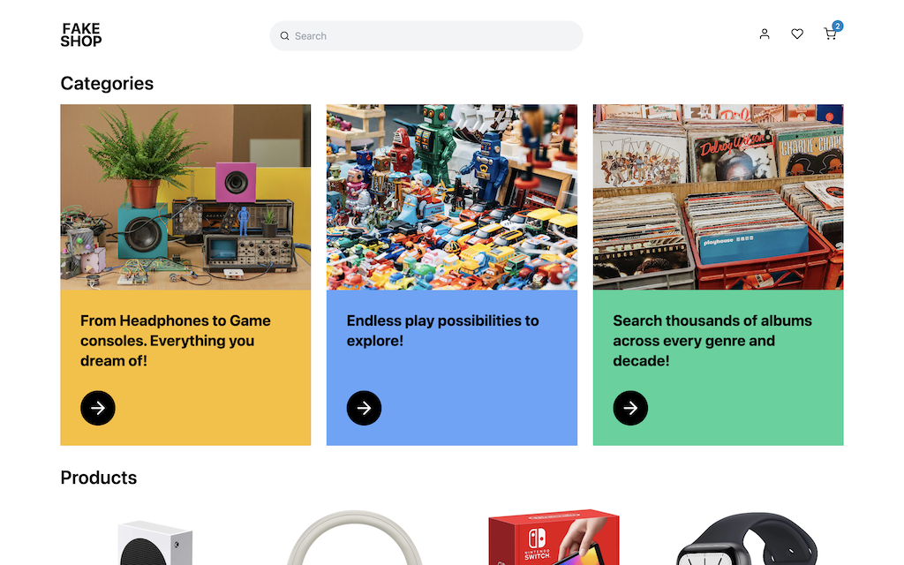
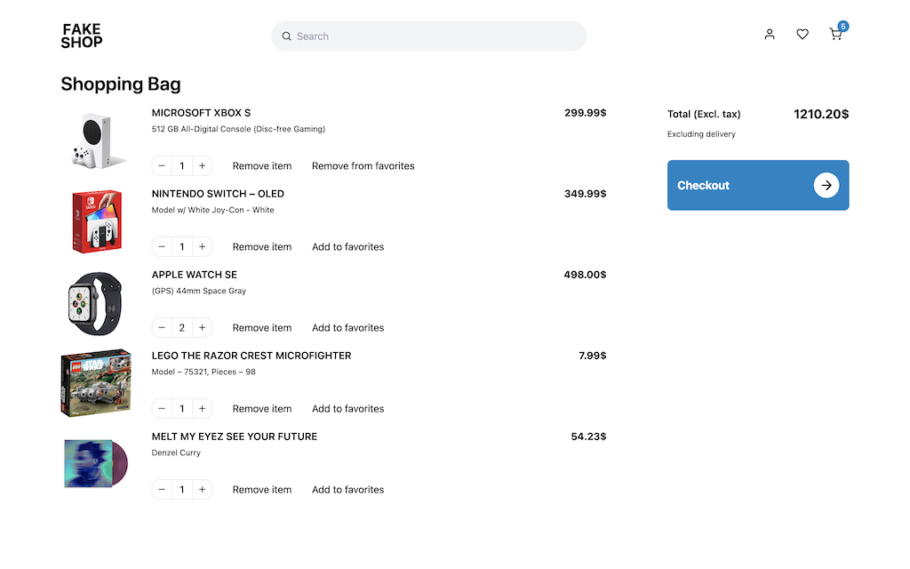
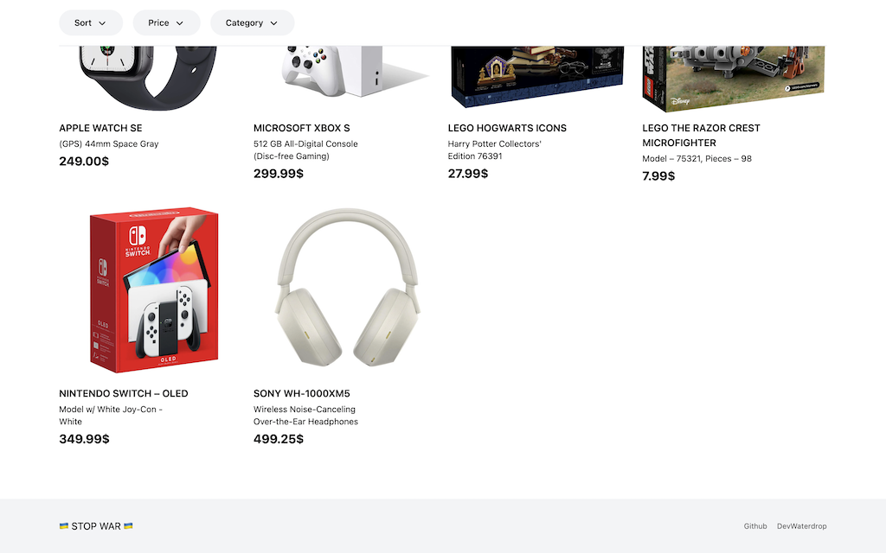

# NX E-commerce project

<p float="left">
  
  
  
</p>

**PREVIEW** – https://nx-ecommerce.waterdrop.dev/

## Table of Contents

- [NX E-commerce project](#nx-e-commerce-project)
  - [Table of Contents](#table-of-contents)
  - [About](#about)
  - [Stack](#stack)
  - [Deployed](#deployed)
  - [Local setup guide](#local-setup-guide)
    - [Back (Strapi)](#back-strapi)
    - [Front (NextJS)](#front-nextjs)

## About

Small demo full-stack monorepo app that features:

- Cart, favorites logic ("Jotai");
- "Authentication" (back-end, cookie authentication);
- Search (query string);
- Checkout/orders logic ("back-end").

Literally full-featured basic E-commerce application.

This project was made with the thought of:

- Accessibility;
- Best practices;
- Semantic HTML;
- Testing (e2e, unit...);
- Performance (e.g. dynamic loading);
- SEO;
- CI/CD;
- Docker support.

I can describe this as an exhausting experience.<br/>
Make monorepo with Strapi (with Graphql) – definitely a pain in an ass, but making it type-safe (typescript) is something on a spiritual level.<br/>
But the most pleasantly part – tweak/config everything (like seriously everything) to make it work with NX.<br/>
If I knew that before, I would go for the T3 stack:<br>TypeScript, Next.js, tRPC, Prisma, Tailwind.

## Stack

**Core:** NX, Typescript;

**Front:** NextJS, Storybook, React Query, Jotai;

**Style:** Windicss/Tailwind (`clsx`*);<br/>
*lovely and faster alternative to `classnames`.

**Back:** Strapi with Graphql (`codegen`, `graphql-request`), PostgreSQL;

**Testing:** React Testing Library / Jest, Cypress.

## Deployed

For Strapi and DB (PostgreSQL) – [Railway](https://railway.app).<br/>
NextJS – [Vercel](https://vercel.com).<br/>
And for images – [Cloudinary](https://cloudinary.com).

## Local setup guide

First of all run – `npm ci`.

### Back (Strapi)

1. Build: `npm run docker-build`.
2. Run: `npm run docker`

**STRAPI DEV USER:**
| User | Password |
| ----- | -------- |
| fake@not_exist_mail.com | Deve1oper |

### Front (NextJS)

Running back end instance is mandatory!

```bash
npm run local-nextjs
# or
nx run nx-ecommerce:serve:development
```
